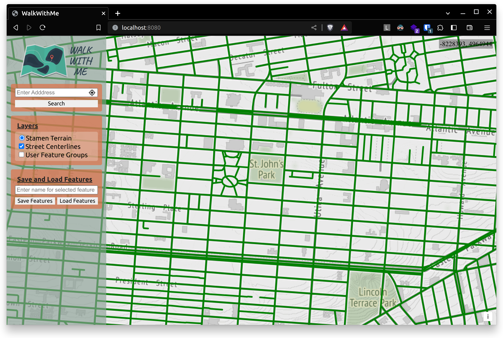

# WalkWithMe

## _Be Open to the Unexpected_

WalkWithMe is a route planner based on [POSTGIS](https://postgis.net/) and [OpenLayers](https://openlayers.org/) that is tailored to neighborhood walking paths. Coverage is currently limited to New York City, but can be expanded to additional locations with the use of OpenStreetMap feature extracts and/or locally maintained street grid geodata.

## Overview

WalkWithMe consists of two modules, which may be adapted and used independently. The first is a streamlined, extensible web map interface built using custom React components wrapping portion of the OpenLayers web mapping API (in particular, specialized components for map layers and layer groups). At present, this interface includes save-and-load functionality for user-defined walking paths -- or, if additional layers are added as described below, arbitrary groupings of vector features of any type.

### Backend: Express, PostGIS, and the Mapbox Vector Tile specification

All geodata -- including prepackaged base maps from OpenStreetMap and custom vector and/or raster datasets -- are obtained from a lightweight server built in Express.js, which in turn takes advantage of the geodata storage and processing capabilities of PostGIS (the geospatial extension to PostgreSQL).

#### Server Structure

The primary task of the WalkWithMe server is to, when provided with web map coordinates conformant to the [MapBox Vector Tile](https://docs.mapbox.com/data/tilesets/guides/vector-tiles-introduction/) specification, retrieve, process, and appropriately package underlying vector data for a particular area of the earth's surface. (In this application, the most relevant vector sources represent roads or other paths.) This is accomplished in three steps, contained within the `layerExtentsController` module:

1. Coordinates representing the web map's zoom level and the local `x` and `y` position of the corresponding map tile are converted to absolute geographic coordinates in the WGS 84 Pseudo-Mercator projection, known colloquially as the "Web Mercator" projection. This is accomplished through a call to PostGIS' [ST_TileEnvelope](https://postgis.net/docs/en/ST_TileEnvelope.html) and ST_MakeEnvelope methods.
2. Via a query to the underlying Postgres/PostGIS database, all features within these bounds are selected from the relevant layer. These features are converted to the Vector Tile format using PostGIS' [ST_AsMVTGeom](https://postgis.net/docs/en/ST_AsMVTGeom.html) method.
3. Results of this query are packaged as a ProtoBuf for easy transfer to the frontend, where they are consumed by OpenLayers' Vector Tile API.

Saving and retrieval of user-defined feature groups is handled through more conventional means, using the GeoJSON specification.

#### PostGIS Setup

While a more detailed guide to database setup is in the works, major points to note and suggested resources are as follows:

1. The PostGIS Project itself provides a [comprehensive guide](https://postgis.net/docs/en/index.html) to installing and enabling geospatial capabilities in PostgreSQL. This should be the first stop for anyone interested in making use of this repository.
2. Geodata are available from a variety of sources, which vary depending on the geographic area of interest. Many cities maintain their own public geodatasets, such as the [New York City Street Centerlines](https://data.cityofnewyork.us/City-Government/NYC-Street-Centerline-CSCL-/exjm-f27b) data used in this application.
3. OpenStreetMap provides a dizzying array of feature data, including user-submitted place-of-interest data. The following tools are particularly useful when extracting subsets of those data for personal use:
   1. The [osmconvert](https://wiki.openstreetmap.org/wiki/Osmconvert) command line tool allows filtering of OSM extracts by geographic extent, feature type, and numerous other attributes, as well as conversion between commonly used data types.
   2. The [osmfilter](https://wiki.openstreetmap.org/wiki/Osmfilter) tool extends `osmconvert`'s attribute-based filtering capabilities.
   3. The incomparable [Tristram Gräbener](https://github.com/Tristramg)'s [osm4routing](https://github.com/Tristramg/osm4routing) tool is indispensable when converting OSM data to topological formats useful for path routing.

### Development Roadmap

As noted above, at present, users may plot intended walking routes using their preferred source of street grid data, then save and load the resulting feature groups with basic identifying information.

The next installment of this tool will feature automated creation of walking paths given a specified length (or, through conversion, intended completion time). The underlying routing algorithm is already under development, and owes an enormous debt of gratitude to [the work of Drs. Robert Lewis and Padraig Corcoran](https://ideas.repec.org/a/spr/joheur/v28y2022i3d10.1007_s10732-022-09493-5.html) on heuristics for the construction of fixed-length circuits through weighted graphs such as those constructed from street networks. Expect updates in the coming weeks and months.

### In Conclusion...

Although this remains a work in progress, I hope that the MVT server, in particular, can be useful to those of you working on similar applications. Any thoughts, comments, questions, or suggestions are more than welcome -- please submit an issue above, or reach out via my [LinkedIn](https://www.linkedin.com/in/kyle-slugg/) or [personal website](https://kyleslugg.co/). My thanks; good luck; and happy mapping!
